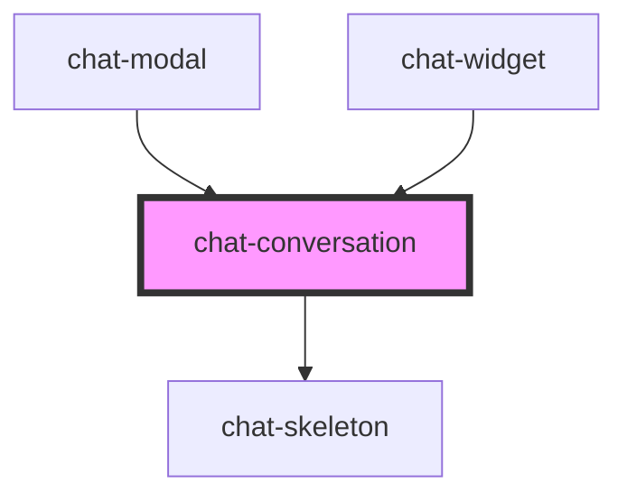

# chat-conversation

<!-- Auto Generated Below -->

## Properties

| Property      | Attribute      | Description | Type     | Default       |
| ------------- | -------------- | ----------- | -------- | ------------- |
| `apiEndpoint` | `api-endpoint` |             | `string` | `Env.API_URL` |

## Dependencies

### Used by

 - [chat-modal](../chat-modal)
 - [chat-widget](../chat-widget)

### Depends on

- [chat-skeleton](../chat-skeleton)

### Graph

----------------------------------------------

*Built with [StencilJS](https://stenciljs.com/)*
