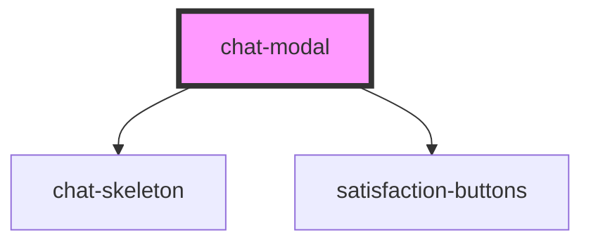

# chat-modal

<!-- Auto Generated Below -->

## Properties

| Property      | Attribute      | Description | Type                                                          | Default                           |
| ------------- | -------------- | ----------- | ------------------------------------------------------------- | --------------------------------- |
| `apiEndpoint` | `api-endpoint` |             | `string`                                                      | `Env.API_URL`                     |
| `iconSize`    | `icon-size`    |             | `number`                                                      | `16`                              |
| `modalTitle`  | `modal-title`  |             | `string`                                                      | `"Que puis-je faire pour vous ?"` |
| `titleStyle`  | `title-style`  |             | `{ fontSize?: string; fontWeight?: string; color?: string; }` | `{}`                              |

## Dependencies

### Depends on

- [chat-skeleton](../chat-skeleton)
- [satisfaction-buttons](../satisfaction-buttons)

### Graph

----------------------------------------------

*Built with [StencilJS](https://stenciljs.com/)*
