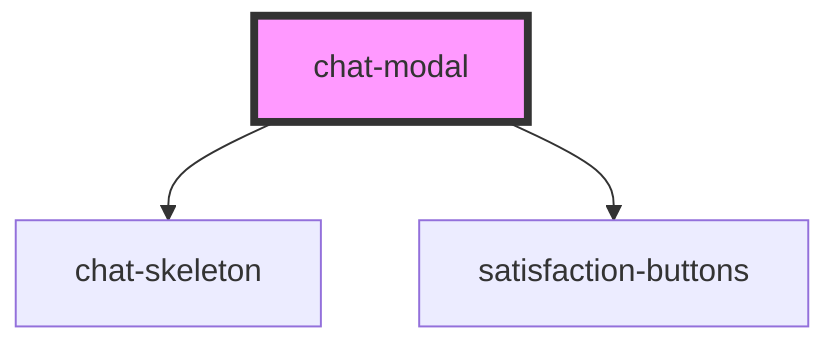

# chat-modal

<!-- Auto Generated Below -->

## Properties

| Property   | Attribute   | Description | Type     | Default                           |
| ---------- | ----------- | ----------- | -------- | --------------------------------- |
| `iconSize` | `icon-size` |             | `number` | `16`                              |
| `title`    | `title`     |             | `string` | `"Que puis-je faire pour vous ?"` |

## Dependencies

### Depends on

- [chat-skeleton](../chat-skeleton)
- [satisfaction-buttons](../satisfaction-buttons)

### Graph

----------------------------------------------

*Built with [StencilJS](https://stenciljs.com/)*
