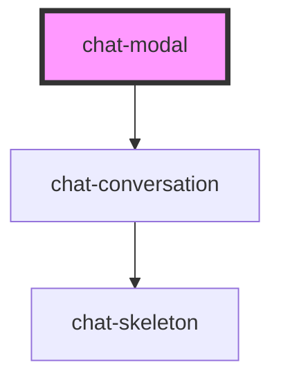

# chat-modal

<!-- Auto Generated Below -->

## Overview

Panneau de chat intégré dans la page.

Ne porte que son chrome : tout le parcours (arbre guidé, réponses
pré-enregistrées, vote, saisie libre) vit dans `chat-conversation`, partagé
avec `chat-widget`. Les deux composants étaient auparavant dupliqués à 90 %,
et leurs divergences étaient des bogues, pas des fonctionnalités.

## Properties

| Property      | Attribute      | Description | Type     | Default                           |
| ------------- | -------------- | ----------- | -------- | --------------------------------- |
| `apiEndpoint` | `api-endpoint` |             | `string` | `Env.API_URL`                     |
| `modalTitle`  | `modal-title`  |             | `string` | `'Que puis-je faire pour vous ?'` |

## Dependencies

### Depends on

- [chat-conversation](../chat-conversation)

### Graph

```mermaid
graph TD;
  chat-modal --> chat-conversation
  chat-conversation --> chat-skeleton
  style chat-modal fill:#f9f,stroke:#333,stroke-width:4px
```

----------------------------------------------

*Built with [StencilJS](https://stenciljs.com/)*
