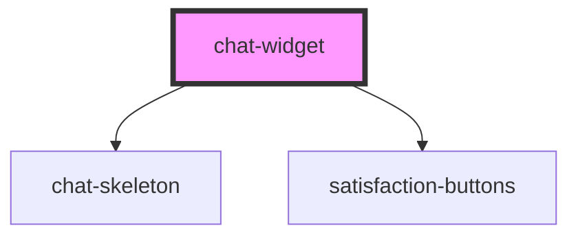

# chat-widget

<!-- Auto Generated Below -->

## Properties

| Property      | Attribute      | Description | Type     | Default                   |
| ------------- | -------------- | ----------- | -------- | ------------------------- |
| `apiEndpoint` | `api-endpoint` |             | `string` | `"http://localhost:8000"` |

## Dependencies

### Depends on

- [chat-skeleton](../chat-skeleton)
- [satisfaction-buttons](../satisfaction-buttons)

### Graph

----------------------------------------------

*Built with [StencilJS](https://stenciljs.com/)*
