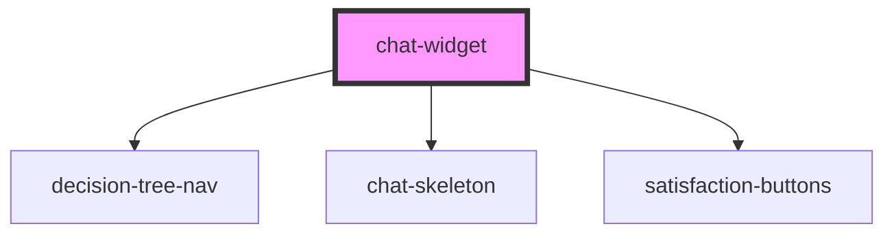

# chat-widget

<!-- Auto Generated Below -->

## Properties

| Property      | Attribute      | Description | Type     | Default       |
| ------------- | -------------- | ----------- | -------- | ------------- |
| `apiEndpoint` | `api-endpoint` |             | `string` | `Env.API_URL` |

## Dependencies

### Depends on

- [decision-tree-nav](../decision-tree-nav)
- [chat-skeleton](../chat-skeleton)
- [satisfaction-buttons](../satisfaction-buttons)

### Graph

```mermaid
graph TD;
  chat-widget --> decision-tree-nav
  chat-widget --> chat-skeleton
  chat-widget --> satisfaction-buttons
  style chat-widget fill:#f9f,stroke:#333,stroke-width:4px
```

----------------------------------------------

*Built with [StencilJS](https://stenciljs.com/)*
