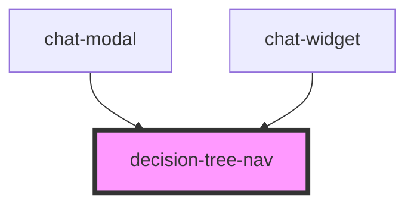

# decision-tree-nav

<!-- Auto Generated Below -->

## Overview

Navigation guidée : l'utilisateur descend l'arbre de décision jusqu'à une
feuille avant de pouvoir poser sa question. Le niveau 1 fournit le
regroupement par thème.

## Properties

| Property      | Attribute      | Description                                                          | Type      | Default |
| ------------- | -------------- | -------------------------------------------------------------------- | --------- | ------- |
| `allowSkip`   | `allow-skip`   | Permet de sauter l'arbre et d'interroger l'ensemble du corpus FASTT. | `boolean` | `true`  |
| `apiEndpoint` | `api-endpoint` |                                                                      | `string`  | `''`    |

## Events

| Event           | Description                                                        | Type                                                         |
| --------------- | ------------------------------------------------------------------ | ------------------------------------------------------------ |
| `leafSelected`  | Émis quand une feuille est atteinte : le chat peut s'ouvrir.       | `CustomEvent<{ node: DecisionNode; path: DecisionNode[]; }>` |
| `skipRequested` | Émis quand l'utilisateur choisit de poser directement sa question. | `CustomEvent<void>`                                          |

## Dependencies

### Used by

 - [chat-modal](../chat-modal)
 - [chat-widget](../chat-widget)

### Graph

----------------------------------------------

*Built with [StencilJS](https://stenciljs.com/)*
