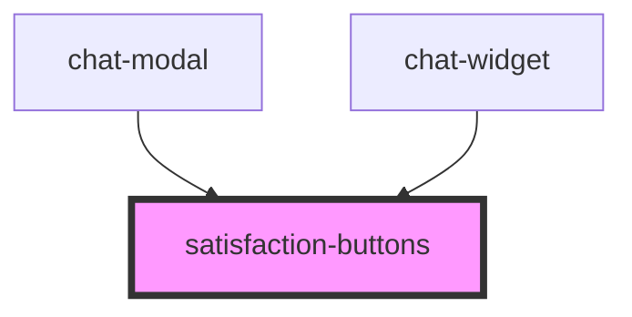

# satisfaction-buttons

<!-- Auto Generated Below -->

## Properties

| Property         | Attribute         | Description | Type     | Default                                       |
| ---------------- | ----------------- | ----------- | -------- | --------------------------------------------- |
| `apiEndpoint`    | `api-endpoint`    |             | `string` | `(Env.API_URL = 'https://fastt.celaneo.com')` |
| `conversationId` | `conversation-id` |             | `string` | `''`                                          |

## Dependencies

### Used by

 - [chat-modal](../chat-modal)
 - [chat-widget](../chat-widget)

### Graph

----------------------------------------------

*Built with [StencilJS](https://stenciljs.com/)*
